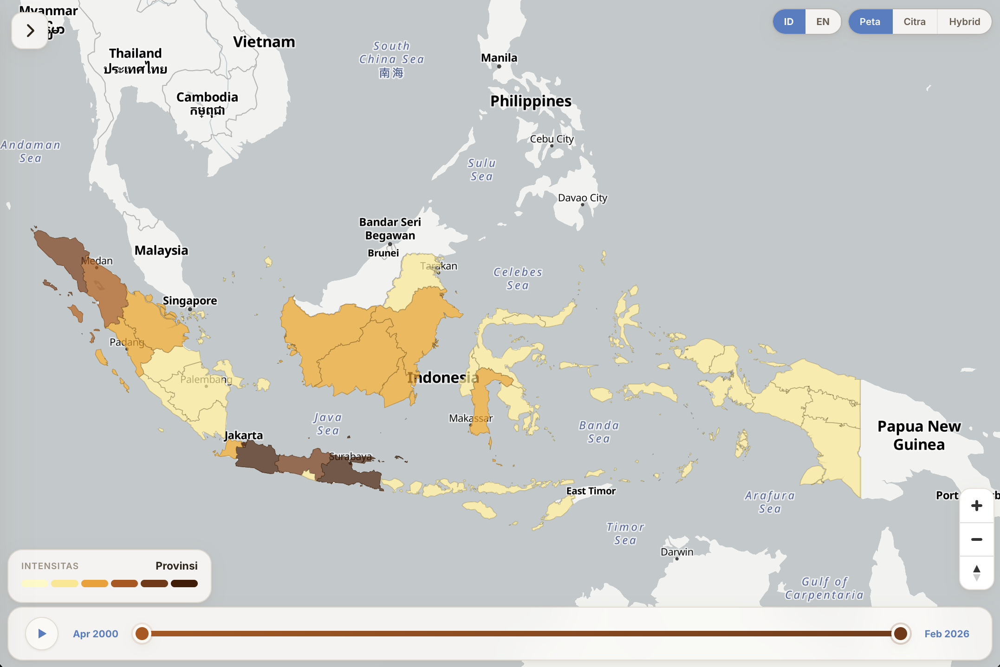

<p align="center">
  
</p>

<h1 align="center">flood-explorer</h1>

<p align="center">
  A bilingual static dashboard for exploring Groundsource flood events across Indonesia's administrative geography.
</p>

<p align="center">
  <a href="#at-a-glance"><code>At a glance</code></a>
  <span>·</span>
  <a href="#local-setup"><code>Local setup</code></a>
  <span>·</span>
  <a href="#rebuild-workflow"><code>Rebuild workflow</code></a>
  <span>·</span>
  <a href="#public-release-shape"><code>Public release shape</code></a>
</p>

## At a glance

<table>
  <tr>
    <td width="33%">
      <strong>Static public delivery</strong><br />
      The shipped app is a plain static site under <code>site/</code> with committed public assets in <code>site/data/latest/</code>.
    </td>
    <td width="33%">
      <strong>Indonesia-first geography</strong><br />
      Groundsource flood footprints are joined into a canonical Indonesian admin hierarchy keyed by province, regency/city, and district codes.
    </td>
    <td width="33%">
      <strong>Public release contract</strong><br />
      The current public release is district-down. Raw inputs and local build outputs stay out of the repository.
    </td>
  </tr>
</table>

## What the dashboard does

- Maps flood intensity across Indonesia using prebuilt JSON assets.
- Supports bilingual browsing with Indonesian and English labels.
- Exposes overview metrics, search, time filtering, and admin-level drill-down.
- Keeps methodology and coverage visible in the public product instead of hiding data caveats.

## Repository layout

- `site/`: static frontend and committed runtime payload
- `scripts/`: ETL, packaging, and inspection scripts
- `tests/`: lightweight Python tests
- `docs/`: schema and reference notes

Local build inputs and intermediate outputs under `data/raw/` and `data/processed/` are intentionally not tracked.

## Local setup

Geometry-heavy scripts should be run on Python 3.13.

```bash
python3.13 -m venv .venv
./.venv/bin/pip install -r requirements.txt
```

## Quick preview

```bash
python3 -m http.server 4173 --directory site
```

Open `http://127.0.0.1:4173/`.

## Rebuild workflow

1. Inspect the remote Groundsource parquet without downloading it.

```bash
./.venv/bin/python scripts/inspect_groundsource.py
```

2. Fetch Indonesia reference sources into `data/raw/`.

```bash
./.venv/bin/python scripts/fetch_sources.py --province 31
```

3. Build canonical reference outputs into `data/processed/`.

```bash
./.venv/bin/python scripts/build_reference_geoparquet.py
```

4. Build Groundsource facts after `data/raw/groundsource/groundsource_2026.parquet` exists locally.

```bash
./.venv/bin/python scripts/build_groundsource_facts.py
```

If the Groundsource parquet is missing, the script writes a manifest with `missing_groundsource_source` instead of failing the whole build.

5. Package the public site payload into `site/data/latest/`.

```bash
./.venv/bin/python scripts/build_public_site_data.py
```

That step refreshes:

- `site/data/latest/build_manifest.json`
- `site/data/latest/boundaries/*.geojson`
- `site/data/latest/search_index.json`
- `site/data/latest/coverage_report.json`
- `site/data/latest/methodology.json`
- `site/data/latest/metrics/...`

## Public release shape

- Groundsource is the flood-event source of truth.
- Indonesian admin codes are the canonical join keys.
- The public release currently includes province, regency/city, and district layers.
- The frontend reads only manifest-driven assets from `site/data/latest/`.
- The dashboard is for public information only, not early warning or operational use.

## Notes

- `wilayah_boundaries` coordinates are stored as `[lat, lng]`, so the ETL swaps them to `[lng, lat]` before writing geometry outputs.
- With the current downloaded sample, the district release gate is expected to fail because nationwide coverage is still incomplete.

## Rights and reuse

This repository is public for transparency and deployment, but no open-source license is granted here. Unless stated otherwise, all rights are reserved by Faiz Krisnadi.
